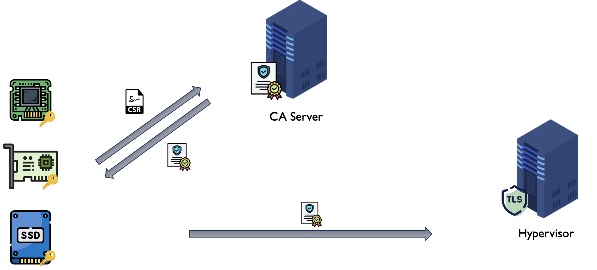

# Capstone Final Project


> Simulating how firmware devices authenticate and establish trust within a Hypervisor using TLS/SSL, enabling secure communication between firmware devices and the Hypervisor.

---

## 🎯 Project Goal

The goal was to create a system where I have full control over which firmware devices are trusted to perform actions within a personal Hypervisor.

A bigger picture idea of how this could also be applied is controlling which devices I trust and creating a secure communication channel with them.



Each device on the left is represented as an image of a potential firmware device that would interact with the Power Hypervisor.

---

## 🔄 Project Flow

Each folder is a separate device.

1. Each device creates its own public and private key using RSA cryptography *(we are assuming this is its first time ever powering on)*.
2. Each device will create a CSR based off a personal config file and send it to my CA. *(Communication between devices is done through socket programming.)*
3. The CA will receive each CSR and only sign them if they meet all custom requirements — authenticating that the user is who they say they are, verifying the integrity of the data, checking that the device is listed in the database and matches the Org name, Common Name, and Serial Number. It also checks that this is the first cert the device has received *(the 0 or 1 check at the start of the database entry)*, then updates it to a 1 if it issues that device a cert. *(Stores a log of both signed and revoked certs.)*
4. Upon the response of the CA, each device will either send its cert signed by the CA to the Power Hypervisor, or — if I programmed them to be "stubborn" — if the CA does not sign their CSR, they will self-sign their CSR and send that cert to the Power Hypervisor.
5. The Power Hypervisor will receive each device's cert, perform the TLS handshake, and only establish a secure connection if it is a cert signed by the trusted CA and not expired. Otherwise the device is not trusted and is disconnected.

---

## 📚 Big Learning Focuses

### 1. Simulating a Custom CA
Working on creating my own CA within a system and only signing certs that meet customized requirements. This allows for creating a personalized CA that can be used for only signing specific requirements, and then on your network only allowing connection to devices with your personal CA signature on certs.

> **For the CA, this project currently checks the serial number, model, and firmware version from the CSR, and that the device sending the CSR has the private key to it based off the public key.**

### 2. Showing the SSL Layer
Showing the SSL layer and how secure communication between firmware devices is not allowed until a trust relationship is secured through a cert that is signed by a trusted CA. For the project, a secure trusted connection is only made with a device to the Power Hypervisor if it is signed by my custom CA. This allows for a secure system where only devices matching personal criteria can be trusted and create a secure connection on the SSL layer to communicate.

### 3. Proper Key & Cert Storage
Proper storage of keys and certs — keeping them separate and not hard coding secrets, but calling from a secure location and returning them after use.

> **Possibly later on also focusing on using an emulated TPM (Trusted Platform Module) to store the CA trusted cert/public key and the private key for the Power Hypervisor.**

> **Note:** Certs for devices are different from basic certs as they will have optional extension fields to show serial number, device name, and date manufactured *(using a config file)*.

---

## 🛠️ Concepts and Tools Used

| Concept / Tool | Description |
|---|---|
| **OpenSSL Library** | Used for all cryptography functions |
| **TLS Handshake** | Core concept recreated when each device tries to establish a secure connection with the Power Hypervisor |
| **Socket Programming & TCP** | Used for communication between devices |
| **Makefile** | Used to automate building and running each device, saving time by not having to manually compile and run each one |
| **Signal Handling** | Used for the Power Hypervisor and CA to simulate server-like behavior — always listening for connections and never shutting off. When the OS catches an action such as `Ctrl+C`, instead of terminating the program it catches the signal and tells the program to properly clean up and shut down |
| **SSH & VS Code Remote Development** | All development was done on macOS while SSH-ing into a Linux machine, acting as a server and providing full access to Linux command line tools and libraries |
| **Asymmetric Cryptography** | Concept used for creating both a public and private key |
| **Chain of Trust** | Concept used for the Power Hypervisor so that it only establishes a secure connection if the cert is signed by the trusted CA |

---

## 🚀 Improvements

- Since this was completed on a deadline, I need to go back and make the code more modular for each device, moving more of the universal functions to the Common file and breaking up the code into more functions, creating a cleaner `main` for each device.
- Possibly add a connections log within the Power Hypervisor for security to monitor all devices that connect.
- Transition from using RSA cryptography for the keys to PQ (Post-Quantum) cryptography, using ML-KEM for key exchange and ML-DSA for digital signatures, ensuring they are PQ secure.
- Store my keys more securely within the Power Hypervisor and CA by emulating a TPM (Trusted Platform Module). Then the key never leaves that emulated chip, making it less vulnerable to private key theft.
- Automate the testing process by taking advantage of Jenkins.

---

## 💡 Lessons Learned

- Understanding the concepts of what you want your project to do before starting to code helps tremendously and saves you a lot of time.
- Laying out a file structure visually on a whiteboard or paper allows for a better understanding of the flow of the project going forward, and helps keep structure and organization once you start coding.
- For each file, taking time to break down the functions into smaller steps allows for a smoother, more organized coding process and makes it easier to know the next step.
- Taking breaks, such as a walk, is a good way to step back and analyze what needs to be accomplished next. Especially helpful when stuck on a bug for a while.
- Creating functions for redundant code early on will save you lots of time down the road. *(I did not do this at first and left myself with a lot of time spent cleaning up code.)*
- With OpenSSL and C, there are a lot of simple checks that can save you a lot of debugging time, such as checking if a value is `NULL` after a function returns.
- **Take advantage of debugging tools.** I used GDB a lot whenever I ran into a bug and it helped me catch it normally pretty quickly. I also used Valgrind whenever I got any memory-related error messages.
- Clear debugging statements were very helpful and saved me a lot of time when bugs appeared. *(For me this was clear print statements for specific checks.)*
- Writing thorough notes on concepts and terms is helpful when trying to learn lots of new things all at the same time.
- When working with a deadline, writing a structured overview of the timeline and having certain deliverables required at the end of each week makes it easier to stay on schedule and maintain consistent progress.

---

## ▶️ How to Run

### Prerequisites
- A Linux machine *(or SSH access to one if you want to run on linux)*
- OpenSSL installed
- GCC / Make installed

### Clone the Repository

```bash
git clone <repo-url>
cd Capstone_Final_Project
```

### Build

```bash
make
```

### Running the Project

You will need **five separate terminals** — one for each of the following: `CA`, `Power_Hypervisor`, `Firmware_Device1`, `Firmware_Device2`, and `Firmware_Device3`.

---

**Step 1 — Start the CA**

```bash
make run-ca [Port Num]
```

Replace `[Port Num]` with your desired port by doing `CA_PORT=12345`, or leave it empty to default to port `9090`.

> ⚠️ **Important — Before continuing:** Once the CA is running, you must manually copy the CA cert from `CA/certs/personal/ca_cert.crt` into the `Power_Hypervisor/trusted_ca/` folder before starting the Hypervisor.
>
> In a real-world deployment, the trusted CA cert would be preinstalled onto the Power Hypervisor before it ever ships. Since that isn't an option in this simulation, this manual copy is the next best approach.


---

**Step 2 — Start the Power Hypervisor**

```bash
make run-power [Port Num]
```

Replace `[Port Num]` with your desired port by doing `POWER_PORT=1234`, or leave it empty to default to port `12000`.

Both the CA and Power Hypervisor are now listening.

---

**Step 3 — Run the Firmware Devices**

Run each device in its own separate terminal. If all terminals are on the same machine, you can use `127.0.0.1` as the IP address.

```bash
make run-device1 [CA IP] [CA Port] [Hypervisor IP] [Hypervisor Port]
make run-device2 [CA IP] [CA Port] [Hypervisor IP] [Hypervisor Port]
make run-device3 [CA IP] [CA Port] [Hypervisor IP] [Hypervisor Port]
```

**Example using loopback:**
```bash
make run-device1 127.0.0.1 9090 127.0.0.1 12000
```

---

**Step 4 — Watch the Output**

As each device runs, you will see output explaining what the device is doing. The CA and Power Hypervisor will also display output for each connection they receive — whether the CA signs or revokes a CSR, and whether the Power Hypervisor validates or rejects a device.

> 🧪 **Fun experiment:** Try modifying a device's config file so it doesn't match the database, or change a `0` → `1` in the database to simulate a device that has already received a cert. Then run the devices and watch how the CA handles duplicates or invalid CSR data, and how the Power Hypervisor disconnects a device whose cert wasn't signed by the trusted CA.

---

**Step 5 — Shutdown**

To shut down the CA or Power Hypervisor, press `Ctrl+C` in their respective terminals. The OS will catch the signal and the program will clean up and shut down properly.

---

## 🗂️ File Structure

```text
Capstone_Final_Project/
├── bin/                        ← Stores all executable files to run each device
├── CA/
├── Common/
├── Firmware_Device1/
├── Firmware_Device2/
├── Firmware_Device3/
├── Power_Hypervisor/
├── .gitignore
├── Makefile
└── README.md
```

---

### CA/

```text
CA/
├── certs/
│   ├── personal/
│   ├── revoked/                          ← CSRs that failed validation
│   └── signed/                           ← Successfully signed certs
│
├── config/
│   └── sample_cert.conf                  ← CA serial #, model, firmware version
│
├── database/                             ← Track if device has received a cert (prevent duplicates)
│   └── sample_db_approved_devices.txt    ← Only validate devices within the database
│
├── keys/
│   ├── sample_rsa_priv_key.pem
│   └── sample_rsa_pub_key.pem
│
├── src/
│   └── main.c
│
└── README.md
```

---

### Common/ *(rename to Library)*

```text
Common/
├── file_utils.c
└── file_utils.h
```

---

### Firmware\_Device/

*Each firmware device contains the same file structure, just with different file naming (device1, device2, device3).*

```text
Firmware_Device/
├── certs/
│   ├── device_cert.crt       ← Cert received from CA or self-signed
│   └── device.csr            ← CSR sent to CA
│
├── config/
│   └── sample_csr.cnf        ← Serial #, model, firmware version
│
├── keys/
│   ├── sample_rsa_priv_key.pem
│   └── sample_rsa_pub_key.pem
│
├── src/
│   ├── main.c
│   └── device_functions.h
│
└── README.md
```

---

### Power\_Hypervisor/

```text
Hypervisor/
├── src/
│   └── main.c                ← Validate certs, allow/deny
│
├── trusted_ca/
│   └── ca_cert.pem           ← CA public cert (trust anchor) / contains CA public key for verification
│
└── README.md
```

---

## 🤝 Contributing

Any and all contributions are welcomed! Whether it's fixing a bug, improving documentation, or suggesting a new feature, I am open to your input and how it can help improve this project.